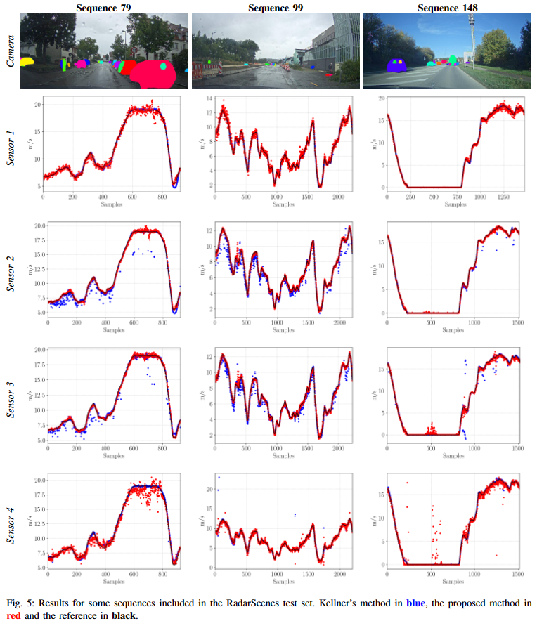

# Overview

This repository contains the code used for the paper [Towards Land Vehicle Ego-Velocity Estimation using Deep Learning and Automotive Radars](). The paper proposes a deep learning framework for estimating ego-velocity of land vehicles equipped with FMCW radars.



# Installation

The project was tested on `Ubuntu 20.04` and `Python 3.8.10`. Other used libraries can be found in the [requirements.txt](requirements.txt) file. After cloning the repository, you can create a custom environment using the following command:

```bash
python3 python3 -m venv env
```

The, proceed with the installation of the required libraries:

```bash
source env/bin/activate
pip3 install -r requirements.txt
```

# Data

Until the publication of this repository, the NavINST dataset was not publicly available. After downloading the RadarScenes dataset, please extract it into the [radarscenes](data/radarscenes/) folder so that the contents appear as follows:


For the MSC-RAD4R dataset, after downloading all urban sequences, extract them into the [mscrad4r](data/mscrad4r/) folder so that the contents look as follows:


The file ``sets.json`` is provided with this repository. Inside each urban sequence, make sure to downnload the following data:


# Code

Inside the [src](src/) folder you can find the codes for each dataset tested. The [utils](src/utils/) folder contains common scripts. The [checkpoints](checkpoints/) folder contains the checkpoints for the proposed models. Finally, the [runs](runs/) folder contains Tensorboard checkpoints for analysis.

Detailed descriptions of the scripts, in order of their utilization, are provided below.

### RadarScenes

| Script | Description |
|:----------------:|---------------|
| [meta](src/radarscenes/meta.py) | Used to compute the lever arm between the vehicle coordinate system and all radars. The acquired information is used inside the [compare](src/radarscenes/compare.py) script. |
| [preprocess](src/radarscenes/preprocess.py) | Used to define the sequences included in the training, validation and test sets used by the [main](src/radarscenes/main.py) script. |
| [dataset](src/radarscenes/dataset.py) | Contains the PyTorch Dataset classes. |
| [main](src/radarscenes/main.py) | Used to train and test the models. By default, the test script saves the estimated outputs as CSV file used by the [compare](src/radarscenes/compare.py) script.|
| [compare](src/radarscenes/compare.py) | Used to compare the proposed models and the benchmarks. Run [main](src/radarscenes/main.py) script in test mode using the desired weights for each sequence available in the test set before comparing the results.|

### NavINST

| Script | Description |
|:----------------:|---------------|
| [sync](src/navinst/sync.py) | Used to sync the radars with the reference. It follows the splits defined in the [sets.json](data/navinst/sets.json) file. |
| [dataset](src/navinst/dataset.py) | Contains the PyTorch Dataset classes. |
| [main_2D](src/navinst/main_2D.py) | Used to train and test the 2D models. By default, the test script saves the estimated outputs as CSV file used by the [compare](src/navinst/compare.py) script.|
| [main_3D](src/navinst/main_3D.py) | Used to train and test the 3D models. By default, the test script saves the estimated outputs as CSV file used by the [compare](src/navinst/compare.py) script.|
| [compare](src/navinst/compare.py) | Used to compare the proposed models and the benchmarks. Run [main_2D](src/navinst/main_2D.py) and [main_3D](src/navinst/main_3D.py) scripts in test mode using the desired weights for each sequence available in the test set before comparing the results.|

### MSC-RAD4R

| Script | Description |
|:----------------:|---------------|
| [pcd](src/pcd/) | Folder containing C++ scripts to extract the point cloud info from PCD files to binary files. |
| [sync](src/mscrad4r/sync.py) | Used to sync the radars with the reference. It follows the splits defined in the [sets.json](data/mscrad4r/sets.json) file. |
| [dataset](src/mscrad4r/dataset.py) | Contains the PyTorch Dataset classes. |
| [main_2D](src/mscrad4r/main_2D.py) | Used to train and test the 2D models. By default, the test script saves the estimated outputs as CSV file used by the [compare](src/mscrad4r/compare.py) script.|
| [main_3D](src/mscrad4r/main_3D.py) | Used to train and test the 3D models. By default, the test script saves the estimated outputs as CSV file used by the [compare](src/mscrad4r/compare.py) script.|
| [compare](src/mscrad4r/compare.py) | Used to compare the proposed models and the benchmarks. Run [main_2D](src/mscrad4r/main_2D.py) and [main_3D](src/mscrad4r/main_3D.py) scripts in test mode using the desired weights for each sequence available in the test set before comparing the results.|

# Citation
If you find this repository helpful, please consider citing:
<!-- ```bibtex

``` -->